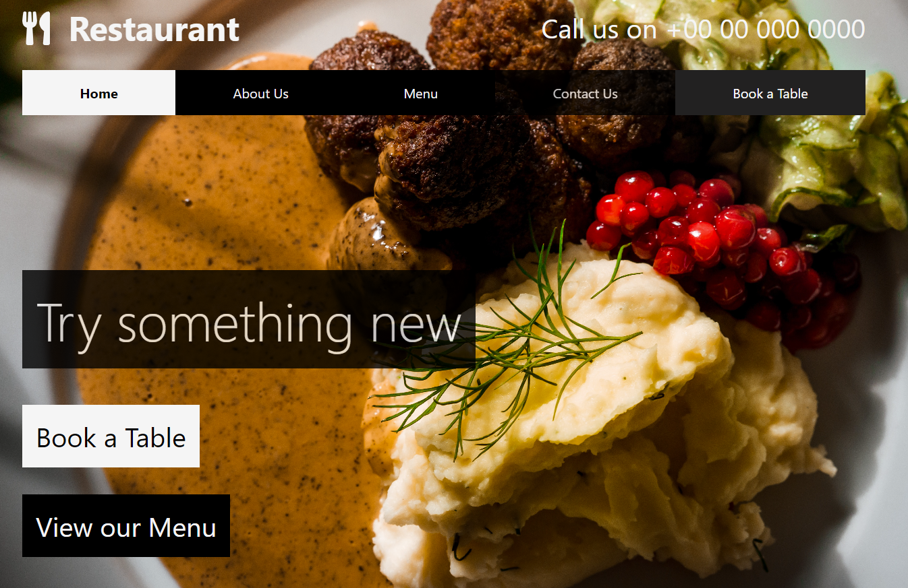

# Restaurant landing page
A React responsive landing page for a restaurant.   

# Motivation
# Build status
# Screenshots

<p align="center">

</p>

# Tech/framework used

Built with: 
- React


# Features
# Code Example
### Installation
```sh
$ cd car-page
$ npm install
$ npm start

```
# API Reference
# How to use?
# Credits

<span>Photo by <a href="https://unsplash.com/@emanuelekstrom?utm_source=unsplash&amp;utm_medium=referral&amp;utm_content=creditCopyText">Emanuel Ekström</a> on <a href="https://unsplash.com/s/photos/swedish-food?utm_source=unsplash&amp;utm_medium=referral&amp;utm_content=creditCopyText">Unsplash</a></span>

